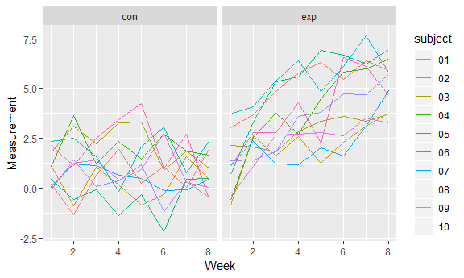

p8105\_hw5\_cj2493
================
Courtney Johnson
November 6, 2018

Problem 1
---------

Create a tidy dataframe from all participants, including the subject ID, arm, and observations over time.

``` r
files_df = 
tibble(vec_files = list.files(path = "./data"), 
       vec_file_path = str_c("./data/", vec_files)) %>%
  mutate(observations = purrr::map(vec_file_path, read_csv)) %>%
  unnest() %>%
  janitor::clean_names() %>%
  separate(vec_files, into = c("arm", "subject"), sep = "_") %>%
  separate(subject, into = c("subject", "extension"), sep = "\\.") %>%
  select(-extension, -vec_file_path) %>%
  gather(key = week, value = measurement, week_1:week_8) %>%
  separate(week, into = c("word", "week"), sep = "_") %>%
  select(-word) %>%
  mutate(subject = as.factor(subject),
         arm = as.factor(arm),
         week = as.numeric(week)) 
head(files_df) %>% knitr::kable()
```

| arm | subject |  week|  measurement|
|:----|:--------|-----:|------------:|
| con | 01      |     1|         0.20|
| con | 02      |     1|         1.13|
| con | 03      |     1|         1.77|
| con | 04      |     1|         1.04|
| con | 05      |     1|         0.47|
| con | 06      |     1|         2.37|

Make a spaghetti plot showing observations on each subject over time, and comment on differences between groups.

``` r
files_df %>%
  ggplot(aes(x = week, y = measurement, color = subject)) +
  geom_line() +
  facet_grid(~arm) +
  labs(x = "Week",
       y = "Measurement")
```



For the control arm, the observations over time jump a lot, but seem to be vary around a stable average. However, for the experimental arm, the observations seem to steadily increase over time.

Problem 2
---------

``` r
city_homicides = read_csv("https://raw.githubusercontent.com/washingtonpost/data-homicides/master/homicide-data.csv") 
```

    ## Parsed with column specification:
    ## cols(
    ##   uid = col_character(),
    ##   reported_date = col_integer(),
    ##   victim_last = col_character(),
    ##   victim_first = col_character(),
    ##   victim_race = col_character(),
    ##   victim_age = col_character(),
    ##   victim_sex = col_character(),
    ##   city = col_character(),
    ##   state = col_character(),
    ##   lat = col_double(),
    ##   lon = col_double(),
    ##   disposition = col_character()
    ## )

Describe the raw data:

The raw data on city homicides contains 52179 observations of 12 variables. Each observation is one homicide, and the variables for each homicide include the reported date, victim last name, victim first name, race, age, and sex of the victim, city, state, latitude, longitude, and the current state of homicide investigation (if it is closed, and if an arrest was made).

Now tidy the data a bit:

``` r
city_homicides = city_homicides %>%
  janitor::clean_names() %>%
  mutate(city_state = str_c(city, ", ", state)) %>%
  group_by(city_state) %>% 
  summarize(n = n(),
            sum_unsolved = sum(disposition == "Closed without arrest" | disposition == "Open/No arrest")) %>%
  rename(total_homicides = n)
```

For the city of Baltimore, use prop.test to estimate the proportion of unsolved cases. Also save the output of prop.test and pull the estimated proportion and confidence interval from the resulting dataframe.

``` r
baltimore_unsolved = city_homicides %>%
  filter(city_state == "Baltimore, MD")
 
prop_output = prop.test(baltimore_unsolved$sum_unsolved, baltimore_unsolved$total_homicides) %>%
  broom::tidy() %>%
  select(estimate, conf.low, conf.high)
```

Now run prop.test and extract the same information for all of the cities:

``` r
prop_pipe = city_homicides %>%
  mutate(prop_output = purrr::map2(sum_unsolved, total_homicides, prop.test)) %>%
  mutate(prop_output = purrr::map(prop_output, broom::tidy)) %>%
  unnest() %>%
  select(city_state, total_homicides, sum_unsolved, estimate, conf.low, conf.high)
```

    ## Warning in .f(.x[[i]], .y[[i]], ...): Chi-squared approximation may be
    ## incorrect

Create a plot that shows the estimates and CIs for each city. Organize the cities according to the proportion of unsolved homicides. (

``` r
prop_pipe %>%
  filter(city_state != "Tulsa, AL") %>%
  mutate(city_state = fct_reorder(city_state, estimate)) %>%
  ggplot(aes(x = city_state, y = estimate)) +
  geom_point() +
  geom_errorbar(aes(ymin = conf.low, ymax = conf.high)) +
  theme(axis.text.x = element_text(angle = 90, hjust = 1, vjust = 0.5)) +
  labs(x = "City", 
       y = "Proportion of Total",
       title = "Unsolved Murders in 50 Large Cities in the United States")
```


I removed the 51st city, Tulsa, AL, because the data was only collected on 50 cities, and Tusla, AL does not exist.
